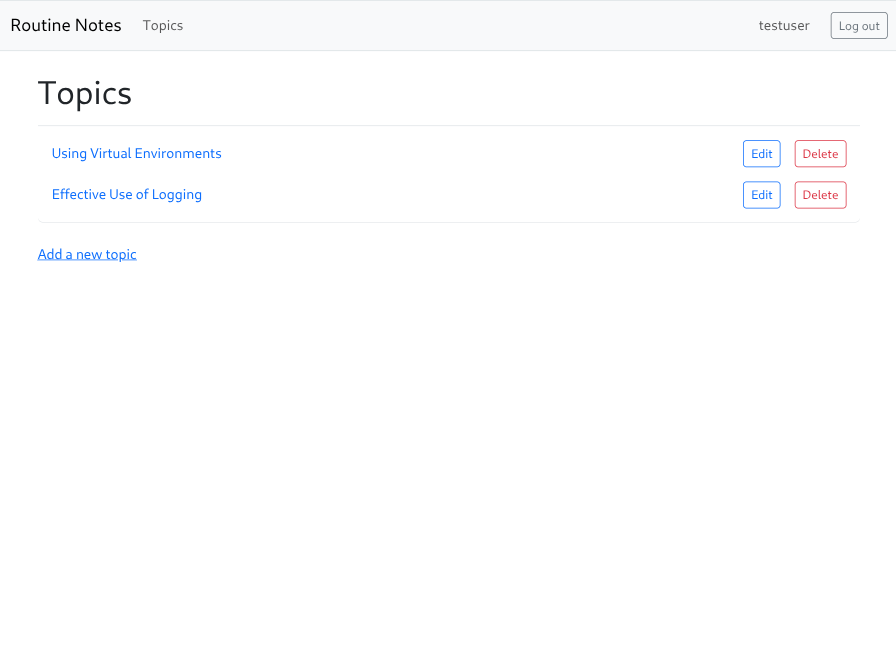

# Routine Saga [](https://opensource.org/licenses/MIT)

## Description

Routine Saga is a journal app implemented in Django to capture those day to day notes that turn into sagas. It is based on the project provided in [Eric Matthes](https://github.com/ehmatthes/pcc_3e) book, [_Python Crash Course, 3rd Edition_ (No Starch Press)](https://nostarch.com/python-crash-course-3rd-edition)

[](https://www.python.org/) [](https://www.djangoproject.com/) [](https://www.postgresql.org/)
[](https://render.com/)
[](https://fontawesome.com/)

## Table of Contents

- [Installation](#installation)
- [Usage](#usage)
- [License](#license)
- [Contributing](#contributing)
- [Tests](#tests)
- [Questions](#questions)

## Installation

1. Change to the project's root directory
2. Create the virtual environment:

```bash
make venv
```

3. Activate the environment:

   - Windows: source .venv/Scripts/activate
   - Nonwindows: source .venv/bin/activate

4. Install the dependency modules:

```bash
pip install -r requirements/local.txt
```

5. Configure the .envs/.env file for your environment (see .envs/.env.EXAMPLE)
6. Create the database:

```bash
psql -U postgres -f db/schema.sql
```

7. Migrate the database:

```bash
python3 manage.py migrate
```

8. Seed the databse:

```bash
python3 manage.py seed
```

## Usage

1. Change to the project's root directory
2. Start the application: python3 manage.py runserver
3. Access the local site at: http://127.0.0.1:8000/
4. To promote an existing account to admin:

    - (Django Admin page: http://127.0.0.1:8000/admin/)

```bash
python33 manage.py promote_to_admin [username]
```


NOTE: See the docs/\*.md for detailed notes including deployment steps

- 

## License

This application is covered under the [MIT](https://opensource.org/licenses/MIT) license

## Contributing

Guidelines:
Ensure your code follows the project's coding standards.
Write clear and concise commit messages.
If your changes include new features, please update the documentation accordingly.
If you are fixing a bug, please include a test to verify the fix.
Thank you for your contributions!

## Tests

Test instructions:

1. Create a new account.
2. Create a new topic.
3. Edit the topic.
4. Create 2 topic entries.
5. Edit an entry.
6. Delete an entry.
7. Delete the topic.

## Future Improvements

- REST using Insomnia (checkin exports), or Postman
- Dockerize
  - dev environment (and use 'gunicorn --reload')
  - Use a postgres container
  - Deploy the container to Render

## Questions

If you have any questions, feel free to reach out:

- GitHub: [clintsrc](https://github.com/clintsrc)
- Email: clinton.alan.jones@gmail.com
